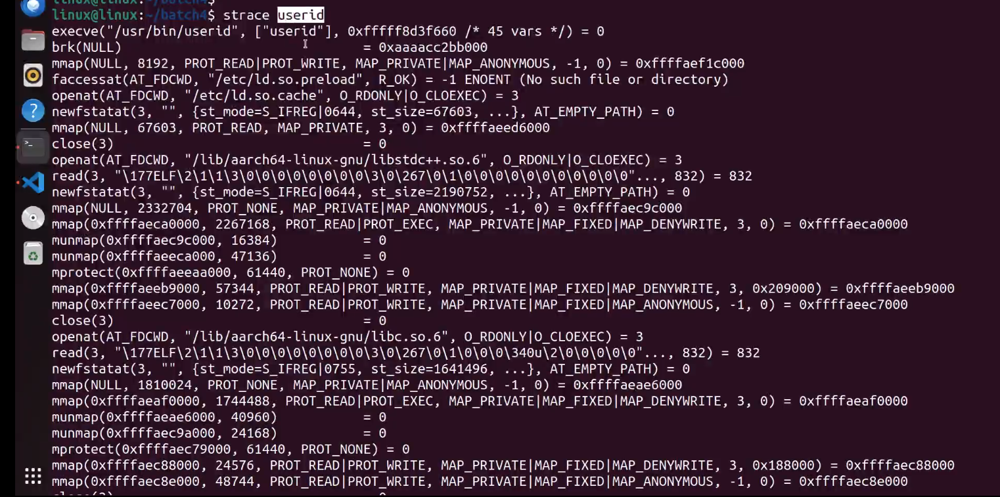
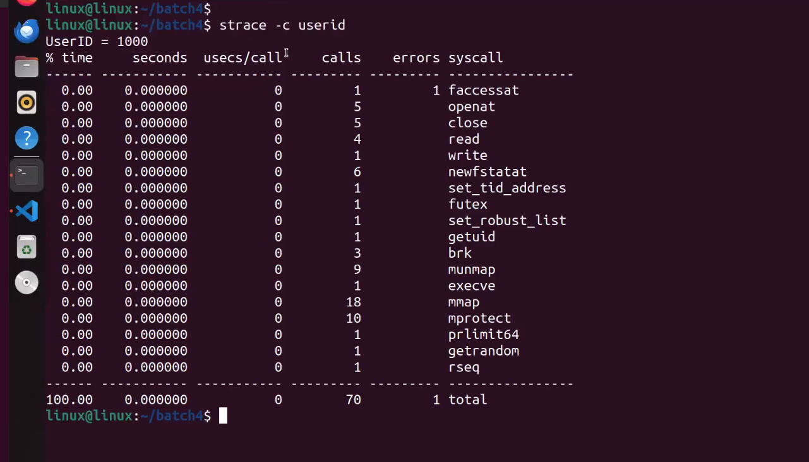

## system call

In computing, a system call is a programmatic way in which a computer program requests a service from the kernel of the operating system it is executed on. A system call is a way for programs to interact with the operating system. A computer program makes a system call when it makes a request to the operating system’s kernel. System call provides the services of the operating system to the user programs via Application Program Interface(API). It provides an interface between a process and an operating system to allow user-level processes to request services of the operating system. System calls are the only entry points into the kernel system. All programs needing resources must use system calls. 

A system call is initiated by the program executing a specific instruction, which triggers a switch to kernel mode, allowing the program to request a service from the OS. The OS then handles the request, performs the necessary operations, and returns the result back to the program.

System calls are essential for the proper functioning of an operating system, as they provide a standardized way for programs to access system resources. Without system calls, each program would need to implement its own methods for accessing hardware and system services, leading to inconsistent and error-prone behavior.

## Services Provided by System Calls


- Process creation and management
- Main memory management
- File Access, Directory, and File system management
- Device handling(I/O)
- Protection
- Networking, etc.
    - Process control: end, abort, create, terminate, allocate, and free memory.
    - File management: create, open, close, delete, read files,s, etc.
    - Device management
    - Information maintenance
    - Communication


## Features of System Calls

- nterface: System calls provide a well-defined interface between user programs and the operating system. Programs make requests by calling specific functions, and the operating system responds by executing the requested service and returning a result.
- Protection: System calls are used to access privileged operations that are not available to normal user programs. The operating system uses this privilege to protect the system from malicious or unauthorized access.
- Kernel Mode: When a system call is made, the program is temporarily switched from user mode to kernel mode. In kernel mode, the program has access to all system resources, including hardware, memory, and other processes.
- Context Switching: A system call requires a context switch, which involves saving the state of the current process and switching to the kernel mode to execute the requested service. This can introduce overhead, which can impact system performance.
- Error Handling: System calls can return error codes to indicate problems with the requested service. Programs must check for these errors and handle them appropriately.
- Synchronization: System calls can be used to synchronize access to shared resources, such as files or network connections. The operating system provides synchronization mechanisms, such as locks or semaphores, to ensure that multiple programs can access these resources safely.

https://filippo.io/linux-syscall-table/

## strace

**strace** is a diagnostic, debugging and instructional userspace utility for Linux. It is used to monitor and tamper with interactions between processes and the Linux kernel, which include system calls, signal deliveries, and changes of process state.

System administrators, diagnosticians and trouble-shooters will find it invaluable for solving problems with programs for which the source is not readily available since they do not need to be recompiled in order to trace them.

```ruby
$ strace filename 
```
i.e.

```ruby
$ strace userinfo 
```
  


optimization:

```ruby
$ strace -c userinfo 
```

  